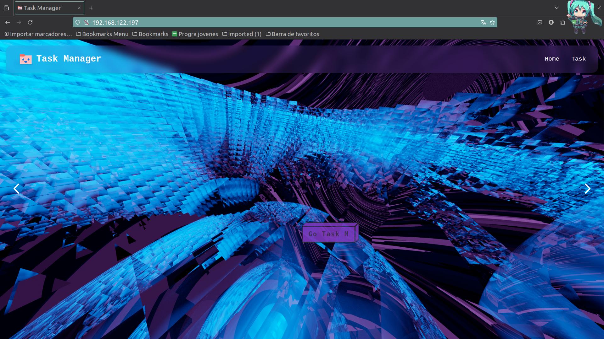
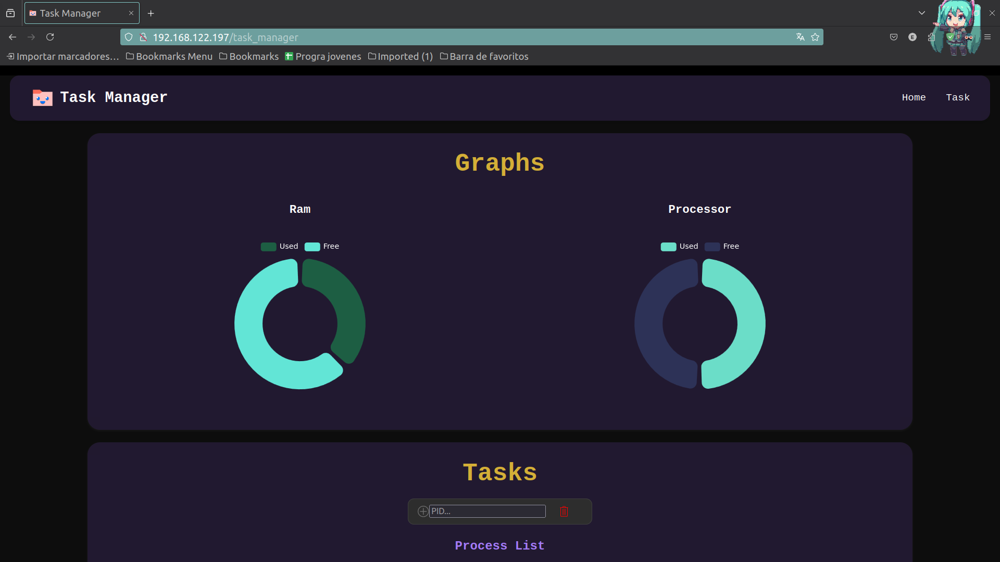
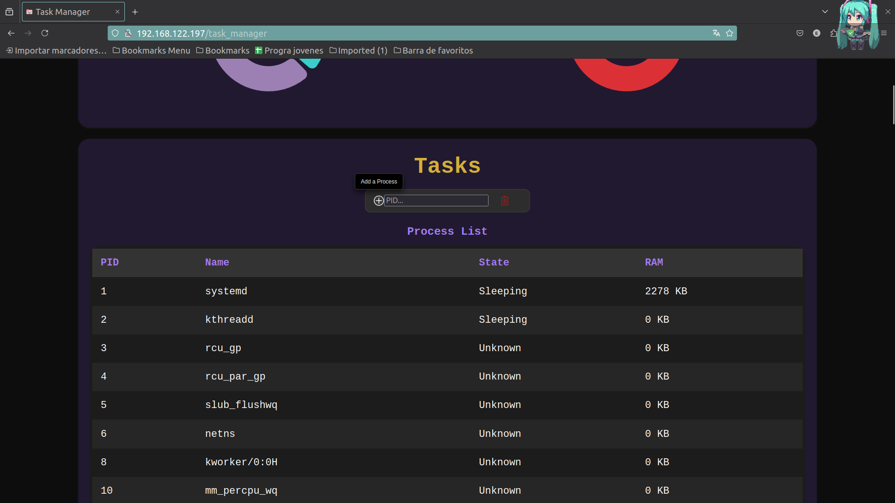
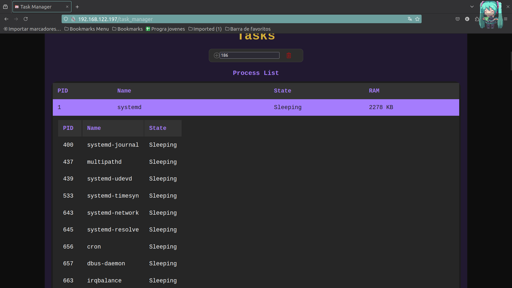
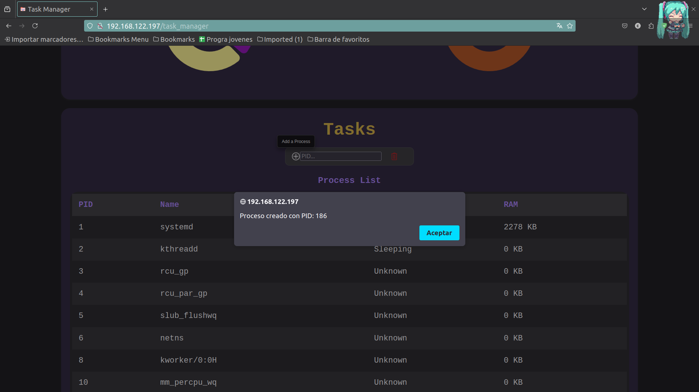
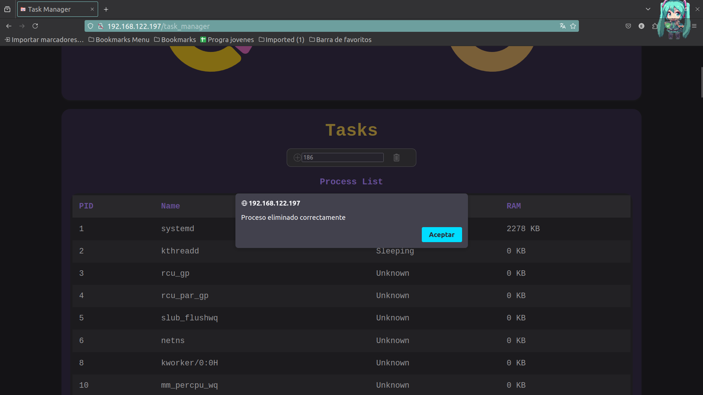

# 🎓 Universidad de San Carlos de Guatemala
## 💻 Ingeniería en Ciencias y Sistemas
## 👨‍🏫 Ing. Sergio Arnaldo Méndez Aguilar
## 👨‍🏫 Aux. Daniel Velásquez
## 🏫 Sección A

# 📂 Proyecto 1

| 🎓 Carnet | 📛 Nombre |
| --------- | --------- |
| 201900647 | Eduardo Josué González Cifuentes |
| 201902301 | Piter Angel Esaú Valiente de León |

# Manual Técnico
## 📚 Contenido
1. [🎯 Objetivo](#-objetivo-del-proyecto)
2. [🚀 Arquitectura del Proyecto](#-arquitectura-del-proyecto)
3. [📃 Requerimientos](#)
    - [📍Tecnologias](#-tecnologías)
    - [📍Herramientas](#️-herramientas)
    - [🛠️Componentes Utilizados](#️-componentes-utilizados)
4. [🖥 Flujo de la aplicación](#)
    - [Comandos Utilizados](#-comandos-utilizados) 
    - [Flujo de proyecto](#-flujo-de-proyecto)
    - [Aplicacion web](#-aplicacion-web)
# 🎯 Objetivo del Proyecto

Implementar una plataforma integral de monitoreo de recursos del sistema y gestión de procesos en tiempo real, utilizando tecnologías y lenguajes de programación modernos, para proporcionar una interfaz amigable y eficiente que permita a los usuarios obtener y administrar información clave sobre el rendimiento del sistema y los procesos en ejecución, desplegada en un entorno de máquina virtual sin interfaz gráfica.

# 👷🏻 Arquitectura del Proyecto

# 📍 Tecnologías

#### Estas son las tecnologías y herramientas utilizadas en el proyecto:


- **Docker:** 26.1.4
- **Docker Compose:** 2.5.0
- **Cuenta en dockerhub**
- **Git:** 2.34.1
- **nodejs:** 20.14.0
- **npm:** 10.7.0
- **golang:** 1.18.1 
- **Ubuntu:** 22.04 LTS
- **Ubuntu Server:** 22.04.4 
- **MongoDB:** 7.0.11
- **QEMU:** 6.2.0 
- **Mpstat:** 
- **Stress:** 1.0.5

# 🛠️ Herramientas
- **Visual Studio Code:** 1.90.1
- **Postman**
- **GitKraken:** 10.0.2
- **MongoDB Compass:** 1.43.0
- **Navegador Web**
- **Virt-Manager**
- **Termius** 
- **KVM**
# 🛠️ Componentes Utilizados
El proyecto utiliza una combinación de tecnologías modernas y robustas para crear un sistema de monitoreo eficiente y de alto rendimiento, desplegado en un entorno virtualizado. Incluye el uso de módulos del kernel para obtener datos del sistema, contenedores para gestión y despliegue, programación asíncrona para eficiencia, y una interfaz web para facilitar la interacción del usuario.

### 🖥️ Máquina Virtual:
- **Sistema Operativo**: Ubuntu Server 22.04
- **Hipervisor**: KVM (Kernel-based Virtual Machine)

### 🛡️ Módulos del Kernel de Linux:

- **Módulo de RAM**:
  - Archivo en `/proc/ram_so1_jun2024`
  - Librería: `<linux/mm.h>`

- **Módulo de CPU**:
  - Archivo en `/proc/cpu_so1_1s2024`
  - Librería: `<linux/sched.h>`


### 🐳 Contenedores:

- **Plataforma de Contenedores**: Docker
- **Base de Datos**: MongoDB (con persistencia mediante Volumen de Docker)
- **Gestión de Contenedores**: Docker Compose
- **Repositorio de Imágenes**: Docker Hub

### 🌐 Frontend:

- **Framework Web**: React con Vite
- **Características**:
  - Gráfica en tiempo real del uso de RAM (obtenida del módulo del kernel)
  - Gráfica en tiempo real del uso de CPU (obtenida mediante `mpstat`)
  - Tabla de procesos con detalles de procesos y subprocesos
  - Botones para crear y eliminar procesos `sleep infinity`

### 🔙 Backend:

- **API**:
  - Lenguaje: Golang
  - Funciones:
    - Llamadas a los módulos en `/proc`
    - Almacenamiento de datos en MongoDB
    - Envío de datos para gráficos en tiempo real
    - Gestión de procesos (`sleep infinity`)

### 🗄️ Base de Datos:

- **Tipo**: NoSQL
- **Motor**: MongoDB
- **Despliegue**: Docker container con persistencia

### 🧪 Pruebas:

- **Pruebas de Stress**: Usando el módulo de Linux para verificar el funcionamiento bajo carga


# 🔧 Comandos Utilizados

Estos comandos proporcionan una guía básica para la instanciación y configuración de los componentes necesarios para la plataforma de monitoreo de procesos en un entorno Linux.


### 🖥️ Máquina Virtual:

##### **Instalar KVM:**

```bash
sudo apt update
sudo apt install qemu-kvm libvirt-daemon-system libvirt-clients bridge-utils virt-manager
```

**Crear y gestionar la VM:**
**virt-manager**
```bash
apt-get install virt-manager
```

##### **Módulos del Kernel de Linux:**
**Crear módulo de RAM:**

```bash
cd /usr/src
mkdir ram_module
cd ram_module
# Crear y editar el archivo ram_so1_jun2024.c
# Compilar el módulo
make -C /lib/modules/$(uname -r)/build M=$PWD modules
# Cargar el módulo
sudo insmod ram_so1_jun2024.ko
```
**Crear módulo de CPU:**

```bash
cd /usr/src
mkdir cpu_module
cd cpu_module
# Crear y editar el archivo cpu_so1_1s2024.c
# Compilar el módulo
make -C /lib/modules/$(uname -r)/build M=$PWD modules
# Cargar el módulo
sudo insmod cpu_so1_1s2024.ko
```


### 🐳Contenedores 
**Instalar Docker:**
```bash
sudo apt update
sudo apt install docker.io
sudo systemctl start docker
sudo systemctl enable docker
```
**Instalar Docker Compose:**

```bash
sudo apt install docker-compose
```
### ⚛️ Frontend (React con Vite):

**Instalar Node.js y npm:**

```bash
curl -sL https://deb.nodesource.com/setup_16.x | sudo -E bash -
sudo apt install -y nodejs
```

**Crear proyecto React con Vite:**

```bash
npm create vite@latest my-react-app --template react
cd my-react-app
npm install
npm run dev
```

**Crear Contenedor de Frontend:**

```Docker
# Desde que lenguaje o framework se va a construir la imagen
FROM node:20-alpine as builder

#Creamos un directorio de trabajo
WORKDIR /client

#Copiar los archivos necesarios para la aplicacion
COPY package.json ./
COPY package-lock.json ./

# Ejecutar el comando para obtener las librerias necesarias
RUN npm install

# Copiar el resto de los archivos
COPY . ./

# Construir la aplicacion
FROM nginx:1.21-alpine as final

# Copiar los archivos de la aplicacion
COPY ./nginx/nginx.conf /etc/nginx/nginx.conf

# Copiar los archivos de la aplicacion
COPY  --from=builder /client/dist /usr/share/nginx/html

# Exponer el puerto 80
EXPOSE 80

# Iniciar el servidor
CMD ["nginx", "-g", "daemon off;"]
```

### 🔙 Backend (API en Golang): 

**Instalar Golang:**

```bash
sudo apt update
sudo apt install golang
```
**Crear proyecto Golang:**

```go
mkdir go_api
cd go_api
go mod init go_api
# Crear y editar archivos fuente
go build
```

**Crear Contenedor de Golang:**

```Docker
# Description: Archivo de configuracion para la creacion de la imagen de docker
FROM golang:alpine AS builder

# Creamos un directorio de trabajo
WORKDIR /go/src/app

# Copiar los archivos necesarios para la aplicacion
COPY . ./

# Ejecutar el comando para obtener las librerias necesarias
RUN go get -d -v
RUN go build -o /go/bin/app

# Construir la aplicacion
FROM alpine:latest

# Instalar las librerias necesarias
RUN apk --no-cache add ca-certificates sysstat

# Copiar la aplicacion
WORKDIR /app
COPY --from=builder /go/bin/app /app
COPY .env /app/.env

# Ejecutar la aplicacion
ENTRYPOINT ["/app/app"]

EXPOSE 3000
```


### 🍃 Base de Datos (MongoDB en Docker):

**Ejecutar MongoDB en Docker:**

```bash
docker pull mongo
docker run -d -p 27017:27017 --name mongodb -v mongo_data:/data/db mongo
```
### 🐙 Gestión de Contenedores con Docker Compose:

###### **Crear archivo docker-compose.yml:**

```yaml
version: '3'

services:
  database:
    image: mongo
    container_name: mongo-container
    restart: always
    environment:
      - MONGO_INITDB_DATABASE=DB
    volumes:
      - mongo-data:/data/db
    ports:
      - '27017:27017'

  server:
    image: lalogg/p1_sopes1_p14_bk:7.0.0
    container_name: server_container
    env_file: .env
    ports:
      - '3000:3000'
    volumes:
      - type: bind
        source: /proc
        target: /proc
    command: /bin/bash -c "apt-get update && apt-get install -y sysstat && ./main"
    restart: always
    depends_on:
      - database
    links:
      - database

  client:
    image: lalogg/p1_sopes1_p14_ftnd:14.0.0
    container_name: client_container
    ports:
      - '80:80'
    restart: always
    depends_on:
      - server
    links:
      - server

volumes:
  mongo-data:
    external: false
```

**Ejecutar Docker Compose:**

```bash
docker compose up
```
### 😫 Pruebas de Stress:

**Instalar y usar stress:**

```bash
sudo apt update
sudo apt-get install -y stress
sudo stress --cpu 2 --timeout 60s
```

**Instalar y usar mpstat**

```bash
sudo apt update
sudo apt install sysstat
```


# 🖥 Flujo de proyecto


#### - 📃 [Crear la máquina virtual con `KVM`](#instalar-kvm)
#### - 📃 [Instalar los módulos del kernel de `Linux`](#módulos-del-kernel-de-linux)
#### - 📃 [Crear y ejecutar los contenedores de Docker via `Docker Compose`](#crear-archivo-docker-composeyml)  
#### - 📃 [Iniciar la aplicación web fuera de la maquina virtual, en el host de Ubuntu y monitorear el uso de `CPU` y `RAM` además de la creación y eliminación de procesos y hacer pruebas de `stress`](#)

# 🌐 Aplicacion web

#### 🏠 Home


#### 📊 Task Manager


#### 📝 Tasks





#### ✍🏼 Create Process



#### 🗑😵 Kill Process

