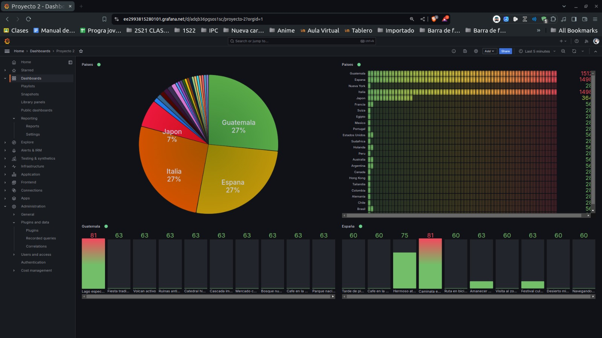
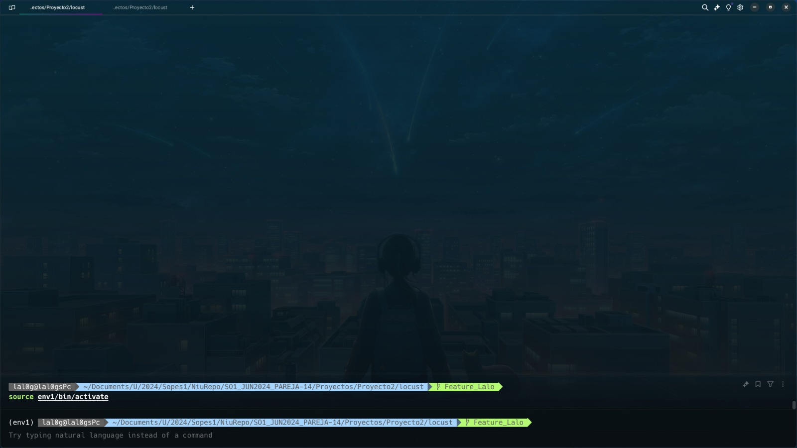
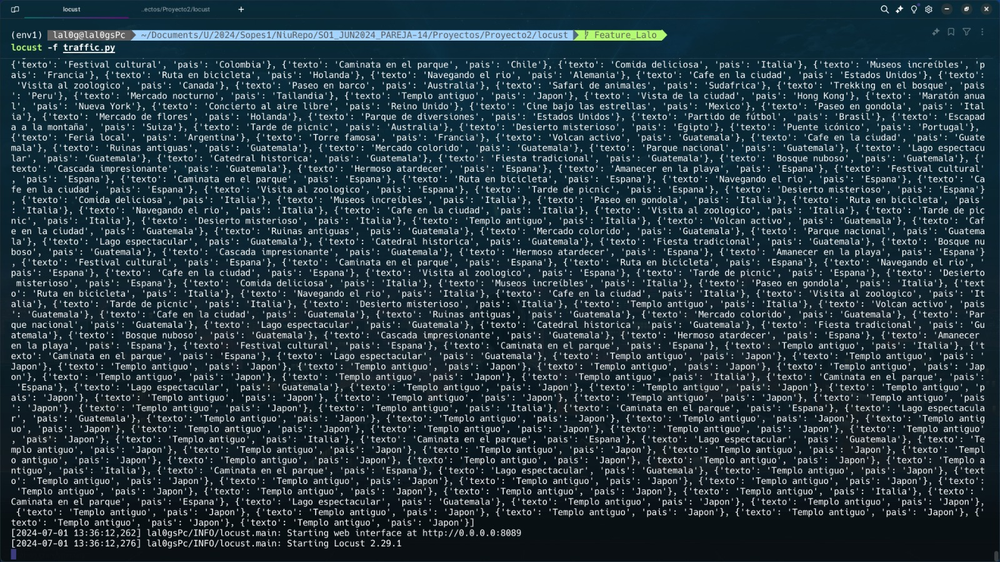
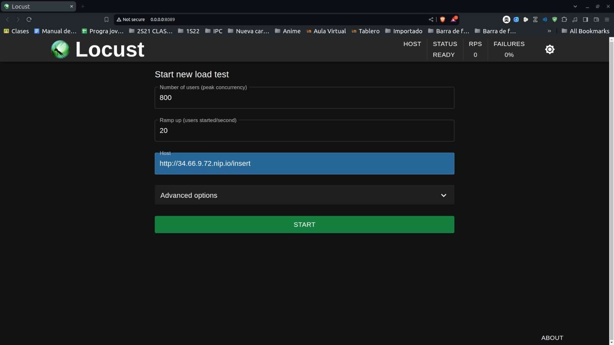
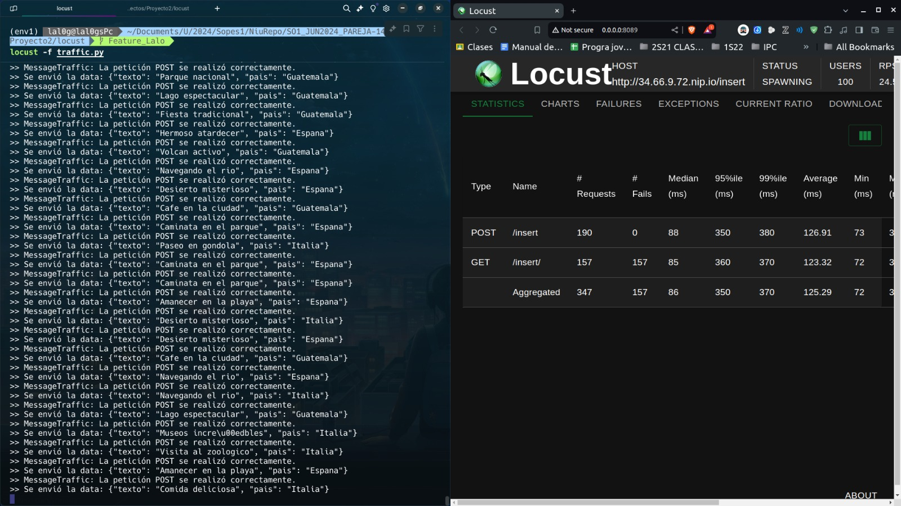
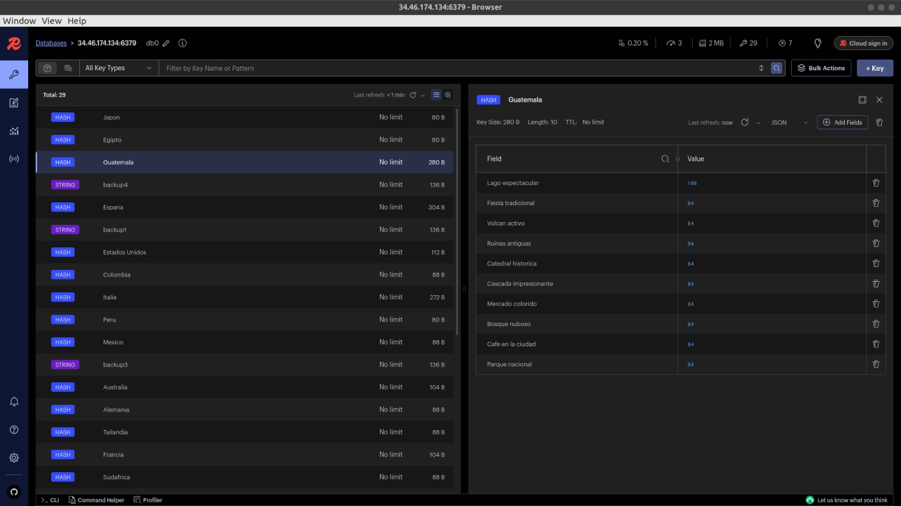
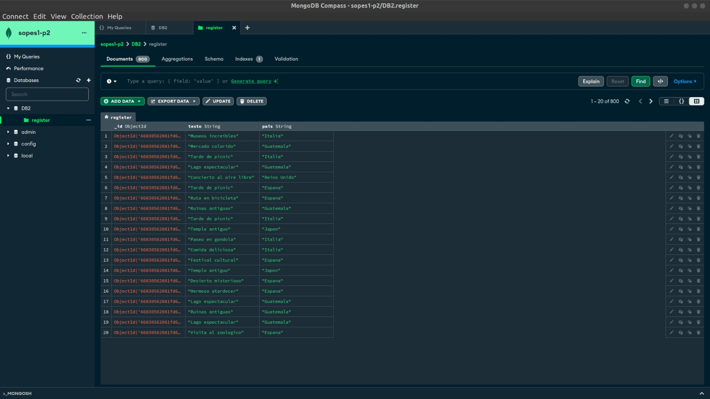

# 🎓 Universidad de San Carlos de Guatemala
## 💻 Ingeniería en Ciencias y Sistemas
## 👨‍🏫 Ing. Sergio Arnaldo Méndez Aguilar
## 👨‍🏫 Aux. Daniel Velásquez
## 🏫 Sección A

# 📂 Proyecto 2

| 🎓 Carnet | 📛 Nombre |
| --------- | --------- |
| 201900647 | Eduardo Josué González Cifuentes |
| 201902301 | Piter Angel Esaú Valiente de León |

# Manual Usuario
## 📚 Contenido
1. [🎯 Objetivo](#-objetivo-del-proyecto)
2. [🖥 Flujo de la aplicación](#)
    - [Aplicacion web](#-aplicacion-web)

# 🎯 Objetivo del Proyecto

Diseñar y desarrollar una arquitectura de sistema distribuida genérica y escalable que pueda procesar y mostrar tweets sobre el clima de diferentes partes del mundo. Además, se busca medir y monitorear el consumo de energía y las emisiones de CO2 de las implementaciones, promoviendo la sostenibilidad ambiental.

# 🌐 Aplicación 

#### 🏠 Dashboard
La aplicación ofrece un dashboard interactivo que muestra estadísticas en tiempo real del sistema y los procesos en ejecución.

#### 📊 Comando de Inicialización
Este comando inicializa el entorno virtual.

#### 📝 Locust
Comando para acceder al cliente de Locust

#### ✍🏼 Utilización de Locust
Locust se utiliza para realizar pruebas de carga de datos masivamente.

#### 🗑😵 Database Redis

#### 🗑😵 Database Mongodb
